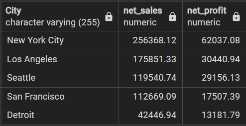

# Superstore-Sales-Analysis

The primary goal of this project is to perform a comprehensive analysis of sales data to extract meaningful insights into sales performance, pinpoint emerging trends, and formulate data-driven business strategies. The aim is to enhance decision-making processes by leveraging valuable information derived from the analysis.

Business problem:
How can the business optimize profits by identifying best performing products, categories, sub-categories, or regions? What are the top performing products and which ones need improvement?

The following steps have been taken for the analysis:
1. The original dataset has been pre-processed using Python to standardize the date columns, check for any missing values etc.
2. The processed dataset was then imported into a new .csv file for analysis
3. In-depth analysis is carried out using PostgreSQL.
4. Visualization of the data is done using PowerBI.


### Query 1: Calculating total sales and profit by year

Net sales and profit is calculated for each year using the below query

```sql
SELECT
    EXTRACT(YEAR FROM "Order Date") AS order_year,
    SUM("Sales") AS total_sales,
    SUM("Profit") AS total_profit
FROM store
GROUP BY order_year
ORDER BY order_year;
```
It is clear that the net sales and profit have generally increased throughout the years (2014-2017) except in 2015 where there was a small dip in sales as compared to the previous year. Profit has steadily increased throughout the years.


This gives us with an overall picture about the sales and profit throughout the years. However, we need to break it down further to identify top and bottom performing areas.

### Query 2: Calculating total sales and profit by quarter

Net sales and profit is calculated for each quarter using the below query

```sql
SELECT
    EXTRACT(YEAR FROM "Order Date") AS order_year,
    EXTRACT(QUARTER FROM "Order Date") AS order_quarter,
    SUM("Sales") AS total_sales,
    SUM("Profit") AS total_profit
FROM store
GROUP BY order_year, order_quarter
ORDER BY order_year, order_quarter;
```

We can see the high performing quarters from the below table. The sales have increased from Q1 to Q4 for every year while the profits have also increased for the years 2014-2015, there was a dip in profit when going from Q2 to Q3 in 2016 and going from Q1 to Q2 in 2017. Q1, Q3, and Q4 of the year 2017 were the highest sale months, while Q2 of 2016 recorded highest sales amongst other quarters. It is evident that most sales are done in Q4 where the profits are also high.


Next we will take a look at the performance by region

### Query 3: Calculating total sales and profit by region

```sql
SELECT 
"Region",
SUM("Sales") AS Net_sales,
SUM("Profit") AS Net_profit
FROM store
GROUP BY "Region"
ORDER BY "Region"
```
West is the best performing region in terms of both sales and net profit followed by East. The sales in South region is the lowest but it still manages to make more profit than the Central region. The situation in Central region is alarming as it generates more sales than the South region but the profit margin is the lowest out of all the regions. Thorough investigation needs to be done and availability of resources needs to be checked.


### Query 4: Total sales and profit by State

```sql
SELECT
    DISTINCT("State"),
	SUM("Sales") AS Net_sales,
	SUM("Profit") AS Net_profit
FROM store
GROUP BY "State"
ORDER BY Net_profit DESC
LIMIT 5
```
California, New York, and Washington are the top 3 states that bring in the highest profits. It is to be noted that even though sales in New York is less than California by more than 14000 but the profits are comparable. This shows that the profit margin is higher for New York. 


### Query 5: Bottom 10 States in terms of profit

```sql
SELECT
      DISTINCT("State"),
      SUM("Sales") AS Net_sales,
      SUM("Profit") AS Net_profit
FROM store
GROUP BY "State"
HAVING SUM("Profit") < 0
ORDER BY Net_profit
```
Texas, Ohio, Pennslyvania, Illinois, North Carolina, Colorado, Tennessee, Arizona, Florida and Oregon are the 10 states that needs attention as they are not even able to break-even. This can be found out using the above query.

Now, let's take a closer look at the cities from these states and how they are faring. The query is given below:

### Query 6: Top 5 Cities in terms of profit

```sql
SELECT
      DISTINCT("City"),
      SUM("Sales") AS Net_sales,
      SUM("Profit") AS Net_profit
FROM store
GROUP BY "City"
ORDER BY Net_profit DESC
LIMIT 5
```
As can be seen from the result below, New York city, Los Angeles, and Seattle are the top performing cities in terms of total profit achieved. In fact, the total profit from New York city was more than the combined profit of the next 2 cities.



While the cities above had excellent sales and profits, there are many cities where urgent action needs to be taken as they are not bringing in any profits despite having considerable sales. Strategy revision and proper planning needs to be done.


